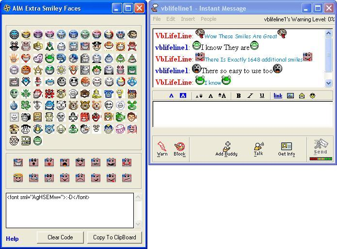



## \[AIM/AOl Secret smiles\]

### Description

with this program you can Unlook secret Smiles on AIM 5.0 or higher and on AOl 8.0 or higher there are excatly 1648 additional smiles. In order for you to view these icons in your istant message you and your freind both hve to be running AIM 5.0 or higher or AOL 8.0 or higher please vot for my submission i worked hard on it
 
### More Info
 

             |
---                |---
**Submitted On**   |2003-05-01 13:51:08
**By**             |[Vblifeline](https://github.com/Planet-Source-Code/PSCIndex/blob/master/ByAuthor/vblifeline.md)
**Level**          |Beginner
**User Rating**    |3.3 (117 globes from 36 users)
**Compatibility**  |VB 6\.0
**Category**       |[Miscellaneous](https://github.com/Planet-Source-Code/PSCIndex/blob/master/ByCategory/miscellaneous__1-1.md)
**World**          |[Visual Basic](https://github.com/Planet-Source-Code/PSCIndex/blob/master/ByWorld/visual-basic.md)
**Archive File**   |[\[AIM\_AOl\_S158162512003\.zip](https://github.com/Planet-Source-Code/vblifeline-aim-aol-secret-smiles__1-45158/archive/master.zip)

